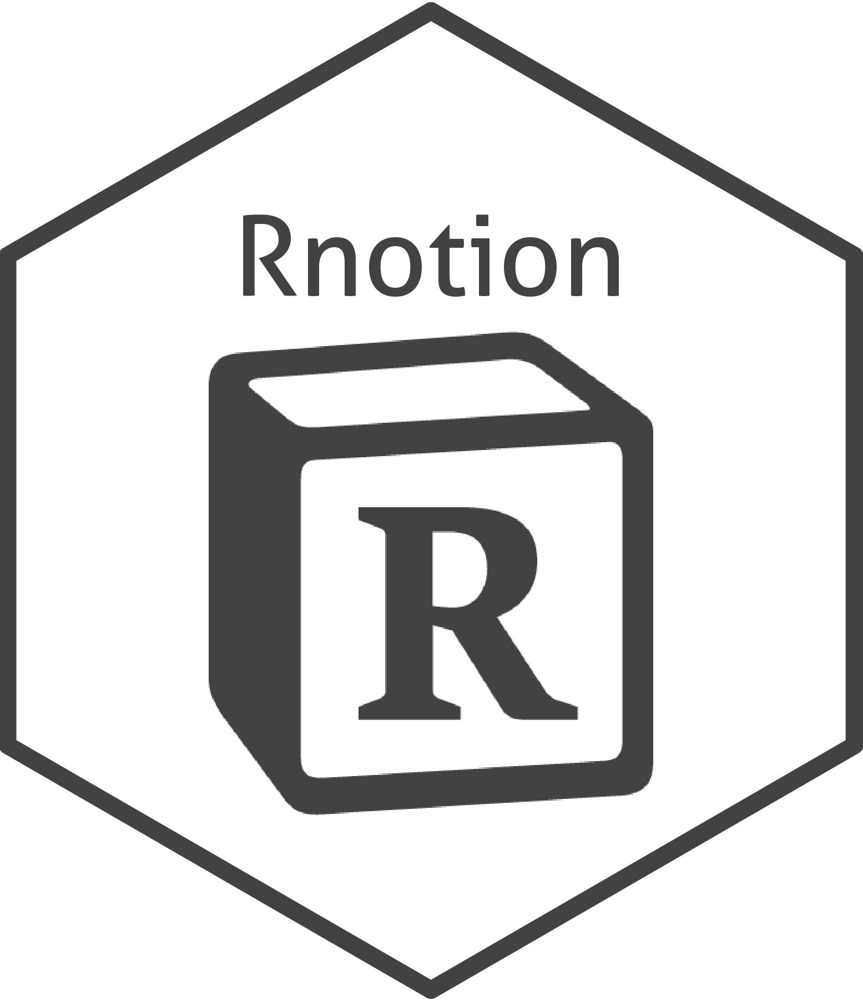

<!-- README.md is generated from README.Rmd. Please edit that file -->

# Rnotion

<!-- badges: start -->



<!-- badges: end -->

The goal of Rnotion is to bridge R to [Notion](notion.so)’s beta
[API](https://developers.notion.com/reference/get-databases) through
R-friendly functions. Behind the scene, Rnotion has utilized the power
of packages like httr and jsonlite for connectivity, and simulated
json-API object using vctrs.

Disclaimers: I’ve nothing to do with notion team at all. The packages
has been built just for the sake of learning.

### Current Project Status

I aim to do things step by step:

1.  Build S3 vectors for each object used in GET and POST in each API -
    e.g. filter\_object, sort\_object
2.  Build primitive API-connected functions to interact with Notion
3.  Build content extraction functions to translate the response in a
    user friendly ways
4.  Build a easy to user wrapper function

| Nope | Under Construction | Somewhat finish                                                     | Wrapper fn available |
|------|--------------------|---------------------------------------------------------------------|----------------------|
|      |                    | [Retrieve a user](https://developers.notion.com/reference/get-user) |                      |
|      |                    |                                                                     |                      |
|      |                    |                                                                     |                      |

## Installation

You can install the released version of Rnotion from
[CRAN](https://CRAN.R-project.org) with:

``` r
# Not Yet
# install.packages("Rnotion")
```

And the development version from [GitHub](https://github.com/) with:

``` r
# install.packages("devtools")
devtools::install_github("Songyosr/Rnotion")
```

## Example

This is a basic example which shows you how to solve a common problem:
